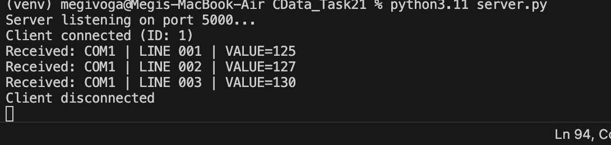
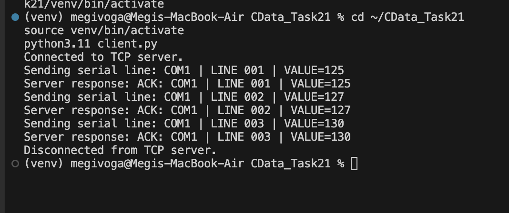
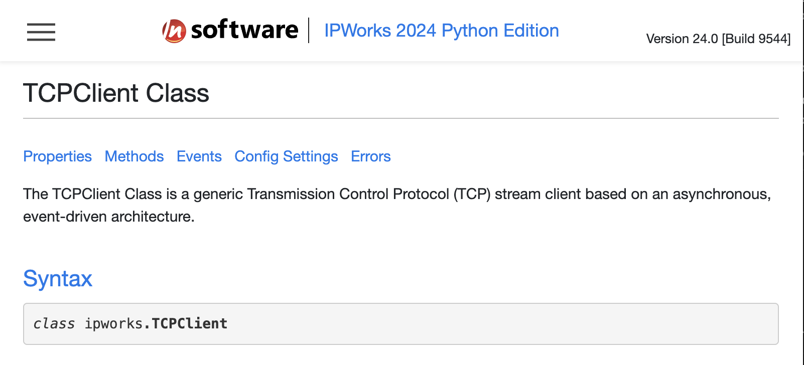
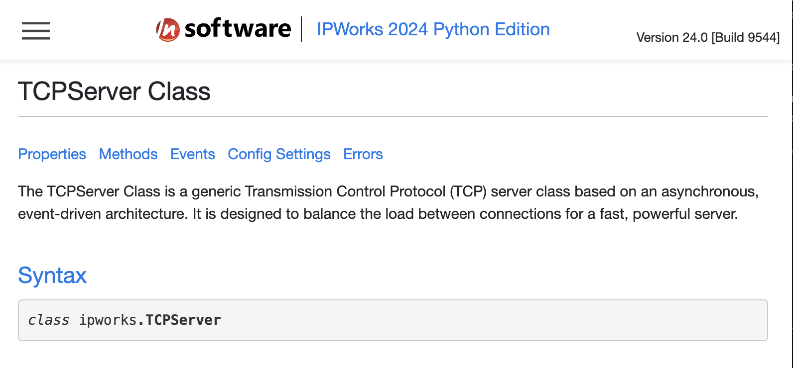

# Case #1 – TCP Client/Server Communication using IPWorks

## Objective

This project demonstrates a TCP client/server communication using **IPWorks 2024 Python Edition**.

The implementation addresses **Case #1** of the CData Software Technical Support Engineer take-home assignment.

---

## Customer Request

> "Which tool should I purchase to develop a client/server application that transfers an asynchronous serial data stream over the Internet between two Delphi applications?"

---

## Proposed Solution

Based on the IPWorks documentation, the recommended components are:

| Sender    | Receiver  | Protocol |
| --------- | --------- | -------- |
| TCPClient | TCPServer | TCP      |

TCP guarantees reliable, ordered delivery of data, making it an appropriate choice for transmitting serial data line by line.

---

## Communication Flow

```text
                Serial Device
                      │
                      ▼
        Delphi Client Application
                      │
                 TCPClient
                      │
            Internet / TCP Connection
                      │
                 TCPServer
                      │
                      ▼
        Delphi Server Application
```

---

## Project Structure

```text
Case01_TCP_Client_Server/
│
├── client.py
├── server.py
├── README.md
└── screenshots/
    ├── client_output.png
    ├── server_output.png
    ├── tcpclient_class.png
    └── tcpserver_class.png
```

---

## Requirements

* Python 3.11+
* IPWorks 2024 Python Edition
* Valid Runtime License

Install IPWorks:

```bash
pip install "/Applications/IPWorks 2024 Python Edition/ipworks-24.0.9544.tar.gz"
```

---

## Running the Demo

### 1. Start the Server

```bash
python3.11 server.py
```

Expected output:

```text
Server listening on port 5000...
```

### Server Execution



---

### 2. Start the Client

Open a second terminal and run:

```bash
python3.11 client.py
```

### Client Execution



---

## Validation Results

| Validation                     | Status |
| ------------------------------ | :----: |
| TCP server started             |    ✅   |
| Client connected               |    ✅   |
| Serial messages transmitted    |    ✅   |
| Messages received by server    |    ✅   |
| ACK responses returned         |    ✅   |
| ACK responses received         |    ✅   |
| Connection closed successfully |    ✅   |

---

## IPWorks Components

### TCPClient Class



The **TCPClient** component establishes a TCP connection with the server and sends each serial data line.

---

### TCPServer Class



The **TCPServer** component listens for incoming client connections, receives data, and returns acknowledgements.

---

## Source Files

### server.py

Responsibilities:

* Start a TCP server
* Listen on port **5000**
* Accept client connections
* Receive incoming messages
* Send acknowledgements (ACK)
* Handle disconnect and error events

---

### client.py

Responsibilities:

* Connect to the TCP server
* Send simulated serial data
* Receive acknowledgements
* Close the connection gracefully

---

## Production Deployment

To deploy this solution:

* Replace `127.0.0.1` with the destination server's public static IP address.
* Replace the simulated serial messages with the real asynchronous serial stream.
* Ensure the selected TCP port is open on the firewall.
* Optionally enable SSL/TLS if encrypted communication is required.

---

## Technologies

* Python 3.11
* IPWorks 2024 Python Edition
* TCPClient
* TCPServer
* TCP/IP
* Visual Studio Code
* macOS

---

## Status

* ✅ Official documentation reviewed
* ✅ Solution identified
* ✅ Prototype implemented
* ✅ Client/Server communication tested successfully
* ✅ Customer scenario validated
