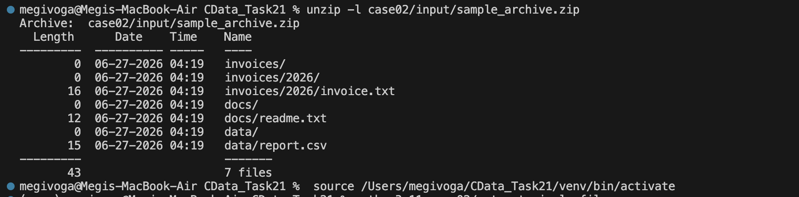
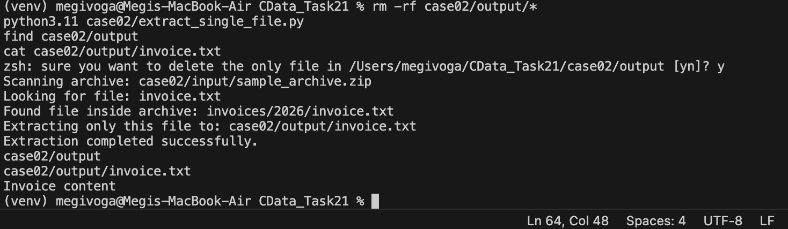
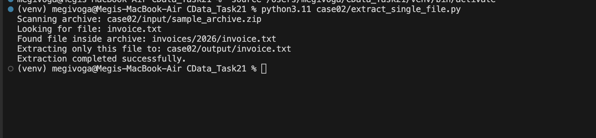
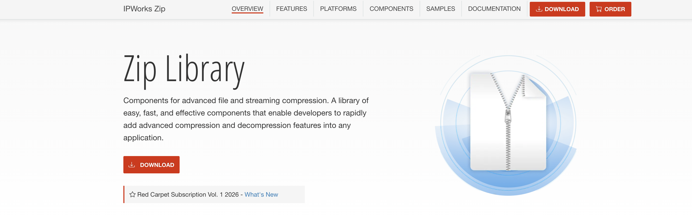

# Case #2 – Extracting a Single File from a ZIP Archive using IPWorks ZIP

## Customer Request

> "I really just want to grab one file out of the zip archive (without knowing in which folder or level it resides within the archive) and have it extracted to a known directory."

The customer wanted to avoid the following workflow:

- Extract the entire ZIP archive
- Search for the required file
- Copy it to another location
- Delete the temporary directory

---

## Problem Analysis

The customer needs to extract a single file from an existing ZIP archive without
knowing its internal folder structure.

Extracting the entire archive would introduce unnecessary disk operations,
increase execution time, require temporary storage, and add additional cleanup
steps.

A more efficient solution is to scan the archive, locate the required file by
its filename, and extract only the matching entry directly to the destination
directory.

---

## Proposed Solution

After reviewing the official IPWorks ZIP documentation, the recommended
component is the **Zip** class.

The solution consists of scanning the archive, locating the requested file, and
extracting only that file.

| Requirement | IPWorks ZIP Solution |
|--------------|----------------------|
| Scan ZIP archive | `scan()` |
| Locate file | `get_file_compressed_name()` |
| Extract one file | `extract()` |
| Destination folder | `set_extract_to_path()` |

---

## Solution Workflow

```text
ZIP Archive
      │
      ▼
Scan Archive
      │
      ▼
Locate Target File
      │
      ▼
Extract Only That File
      │
      ▼
Known Output Directory
```

---

## Project Structure

```text
case02/
│
├── extract_single_file.py
├── README.md
├── input/
│   └── sample_archive.zip
├── output/
│   └── invoice.txt
└── screenshots/
    ├── archive_contents.png
    ├── extraction_output.png
    ├── output_verification.png
    └── zip_class.png
```

---

## Installation

Requirements:

- Python 3.11+
- IPWorks ZIP 2024 Python Edition
- Valid Runtime License

Install IPWorks ZIP:

```bash
pip install "/Applications/IPWorks ZIP 2024 Python Edition/ipworkszip-24.0.9544.tar.gz"
```

---

## Test Archive

The following archive was created for testing.

```text
sample_archive.zip
│
├── docs/
│   └── readme.txt
│
├── invoices/
│   └── 2026/
│       └── invoice.txt
│
└── data/
    └── report.csv
```

The objective was to extract only **invoice.txt** without extracting the
remaining archive contents.

### Archive Contents



---

## Running the Demo

Execute:

```bash
python3.11 extract_single_file.py
```

### Execution Output



---

## Validation

The script successfully identified the requested file inside the archive and
extracted only that file into the destination directory.

Result:

```text
case02/output/
└── invoice.txt
```

Verification:

```bash
cat case02/output/invoice.txt
```

The extracted file was verified successfully.

### Output Verification



---

## How It Works

The implementation performs the following steps:

1. Opens the ZIP archive.
2. Scans all archive entries.
3. Searches for the requested filename.
4. Finds the matching file regardless of its folder depth.
5. Extracts only the matching file.
6. Saves it directly into the destination directory.

No temporary extraction of the complete archive is required.

---

## Official Documentation

The implementation was developed using the official IPWorks ZIP documentation
and validated through a practical prototype.

### Zip Class Documentation



The following APIs were used:

- `scan()`
- `extract()`
- `set_archive_file()`
- `set_extract_to_path()`
- `get_file_count()`
- `get_file_compressed_name()`
- `set_file_decompressed_name()`

---

## Source File

### extract_single_file.py

Responsibilities:

- Open the ZIP archive.
- Scan archive contents.
- Locate the requested file.
- Extract only the matching file.
- Save it directly to the destination directory.

---

## Validation Results

| Validation Step | Status |
|------------------------------|:------:|
| ZIP archive opened | ✅ |
| Archive scanned | ✅ |
| Target file located | ✅ |
| Single file extracted | ✅ |
| Output file verified | ✅ |
| Customer scenario validated | ✅ |

---

## Production Deployment

For production use:

- Replace the sample archive with the customer's ZIP archive.
- Replace the target filename with the desired file.
- Configure the destination output directory as required.
- Handle duplicate filenames appropriately if multiple archive entries match the requested filename.

---

## Conclusion

The implemented prototype confirms that the IPWorks ZIP **Zip** component fully
supports extracting a single file from an existing ZIP archive without
extracting the remaining contents.

By scanning the archive, locating the requested entry, and extracting only the
matching file, the proposed solution is both simpler and significantly more
efficient than extracting the complete archive to a temporary directory.

The implementation was successfully tested using **IPWorks ZIP 2024 Python
Edition** and validates the recommendation provided to the customer.