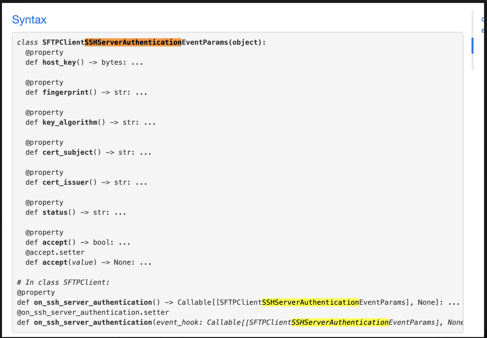
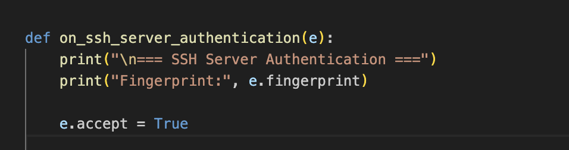
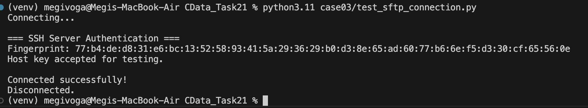

# Case #3 – Handling SFTP Host Key Verification using IPWorks SSH

## Customer Request

> "Hi, I am currently using your software in its trial version. My goal is to test the SFTP transfer of files. I am currently getting an error **'Server's host key has been rejected by user'**. I would like my application to turn off server's host key verification. How to do it?"

---

## Problem Analysis

The customer is attempting to establish an SFTP connection, but the SSH server's host key is rejected during authentication.

Completely disabling host key verification is not recommended because it removes an important security check. Instead, the application should handle the server authentication event and decide whether to accept or reject the presented host key.

For testing purposes, the host key can be accepted automatically. In production environments, the server fingerprint should always be verified before accepting the connection.

---

## Proposed Solution

After reviewing the official IPWorks SSH documentation, the recommended solution is to use the **SFTPClient** component together with the **SSHServerAuthentication** event.

When this event is triggered, the application receives the server fingerprint and can decide whether to accept or reject the server host key.

For testing, the host key can be accepted programmatically:

```python
e.accept = True
```

For production environments, the fingerprint should first be compared against a trusted value before accepting the connection.

---

## Project Structure

```text
case03/
│
├── test_sftp_connection.py
├── sftp_host_key_verification.py
├── README.md
└── screenshots/
    ├── ssh_server_authentication_doc.png
    ├── host_key_handler.png
    └── sftp_connection_success.png
```

---

## Requirements

* Python 3.11+
* IPWorks SSH 2024 Python Edition
* Valid IPWorks SSH Runtime License

Install the package:

```bash
pip install "/Applications/IPWorks SSH 2024 Python Edition/ipworksssh-24.0.9545.tar.gz"
```

---

## Test Environment

The implementation was validated using the **Rebex SFTP Test Server**, a public server commonly used for SFTP development and testing.

Server configuration:

```text
Host: test.rebex.net
Port: 22
Username: demo
Password: password
```

---

## Running the Demo

Execute:

```bash
python3.11 test_sftp_connection.py
```

---

## Expected Output

```text
Connecting...

=== SSH Server Authentication ===
Fingerprint:
77:b4:de:d8:31:e6:bc:13:52:58:93:41:5a:29:36:29:b0:d3:8e:65:ad:60:77:b6:6e:f5:d3:30:cf:65:56:0e

Host key accepted for testing.

Connected successfully!
Disconnected.
```

---

## Documentation

The implementation is based on the **IPWorks SSH – SFTPClient** component.

### SSHServerAuthentication Event



The documentation shows that the `SSHServerAuthentication` event provides access to the server fingerprint and allows the application to decide whether the server host key should be accepted or rejected.

---

## Implementation

The prototype demonstrates how the `SSHServerAuthentication` event can be handled in Python.

### Host Key Handler



The event handler receives the server fingerprint and accepts the host key for testing purposes by setting:

```python
e.accept = True
```

---

## Validation

The solution was successfully tested using the **Rebex SFTP Test Server**.

### Successful Connection



The execution confirms that:

* the `SSHServerAuthentication` event was triggered;
* the server fingerprint was received successfully;
* the server host key was accepted for testing;
* the SFTP connection was established successfully;
* the connection closed normally.

This validates the proposed solution for the customer's scenario.

---

## Source Files

### test_sftp_connection.py

Demonstrates:

* connecting to an SFTP server;
* handling the `SSHServerAuthentication` event;
* accepting the server host key for testing;
* establishing a successful SFTP connection;
* disconnecting gracefully.

### sftp_host_key_verification.py

Provides a minimal example showing how to handle SSH server host key verification using the IPWorks SSH `SFTPClient` component.

---

## Production Recommendation

Automatically accepting every server host key should only be used during testing.

For production deployments, the application should compare the received server fingerprint against a trusted fingerprint and accept the connection only when they match.

---

## Technologies

* Python 3.11
* IPWorks SSH 2024 Python Edition
* SFTPClient Component

---

## Status

* ✅ Documentation Reviewed
* ✅ Solution Identified
* ✅ Prototype Implemented
* ✅ Successfully Tested Against the Rebex SFTP Test Server
* ✅ Customer Scenario Validated
