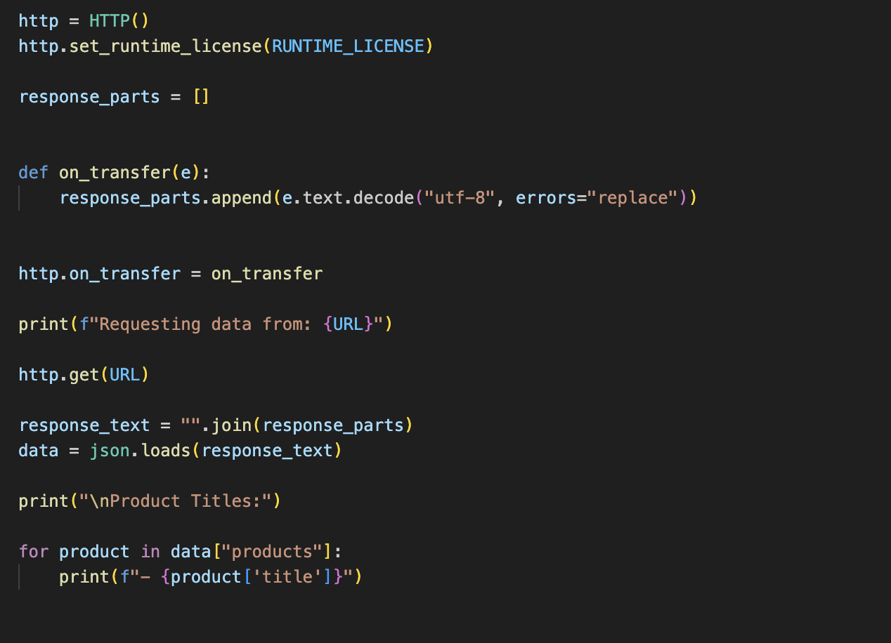
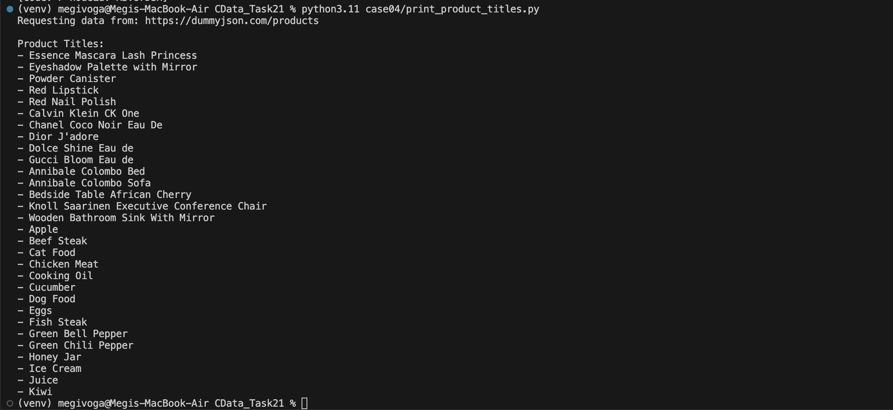

# Case #4 – Retrieving Product Titles from a REST API using IPWorks HTTP

## Customer Request

> "I am trying to print all product titles from this endpoint: https://dummyjson.com/products. How can I do that using your components? Can you provide some demo code?"

---

## Problem Analysis

The customer wants to retrieve data from a REST API and print the title of every product returned by the endpoint.

The endpoint returns a JSON response containing an array named `products`, where each object includes a `title` field. The application therefore needs to:

* send an HTTP GET request;
* receive the JSON response;
* parse the JSON data;
* print the title of each product.

---

## Proposed Solution

The recommended solution is to use the **HTTP** component provided by IPWorks.

The component performs an HTTP GET request to the endpoint, retrieves the JSON response, and allows the application to process the returned data.

After receiving the response, the JSON is parsed and the `title` field of every product is printed.

---

## Project Structure

```text
case04/
│
├── print_product_titles.py
├── README.md
└── screenshots/
    ├── http_demo_code.png
    └── product_titles_output.png
```

---

## Requirements

* Python 3.11+
* IPWorks 2024 Python Edition
* Valid IPWorks Runtime License

Install the package:

```bash
pip install "/Applications/IPWorks 2024 Python Edition/ipworks-24.0.xxxx.tar.gz"
```

---

## API Endpoint

The prototype retrieves product information from:

```text
https://dummyjson.com/products
```

---

## Running the Demo

Execute:

```bash
python3.11 print_product_titles.py
```

---

## Expected Output

```text
Requesting data from:
https://dummyjson.com/products

Product Titles:

- Essence Mascara Lash Princess
- Eyeshadow Palette with Mirror
- Powder Canister
- Red Lipstick
- Red Nail Polish
...
```

---

## Implementation

The prototype uses the IPWorks **HTTP** component to send a GET request to the API endpoint.

After receiving the response, the JSON content is parsed using Python's built-in `json` module, and the application prints the title of every product returned by the API.

### Demo Code



---

## Validation

The prototype was executed successfully against the DummyJSON public API.

### Execution Result



The execution confirms that:

* the HTTP request completed successfully;
* the JSON response was received;
* the response was parsed correctly;
* all product titles were printed.

This validates the proposed solution for the customer's request.

---

## Source File

### print_product_titles.py

Demonstrates:

* sending an HTTP GET request;
* receiving a JSON response;
* parsing the response;
* printing all product titles.

---

## Technologies

* Python 3.11
* IPWorks 2024 Python Edition
* HTTP Component
* JSON

---

## Status

* ✅ Documentation Reviewed
* ✅ Solution Identified
* ✅ Prototype Implemented
* ✅ Successfully Tested
* ✅ Customer Scenario Validated
